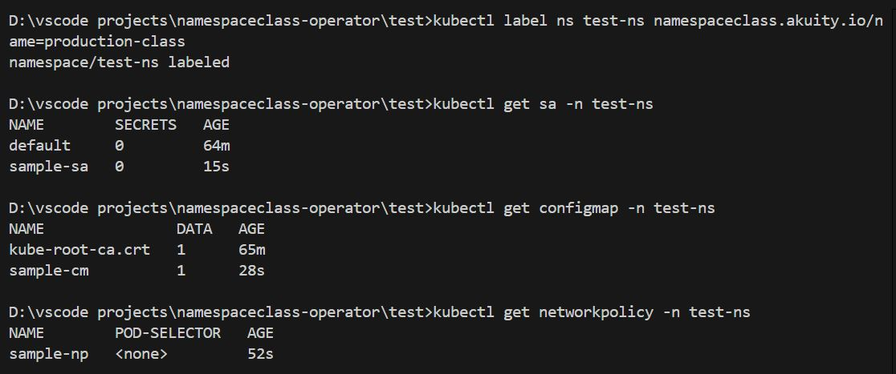
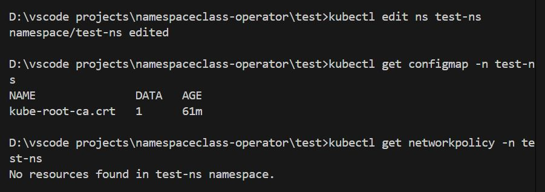
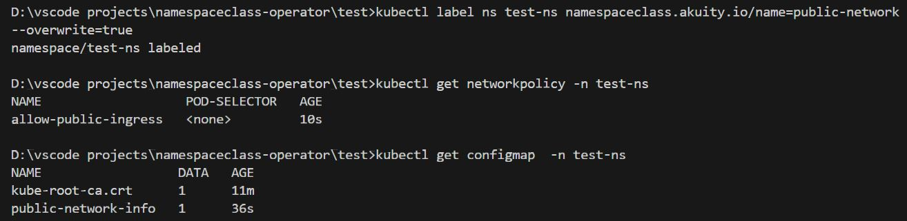
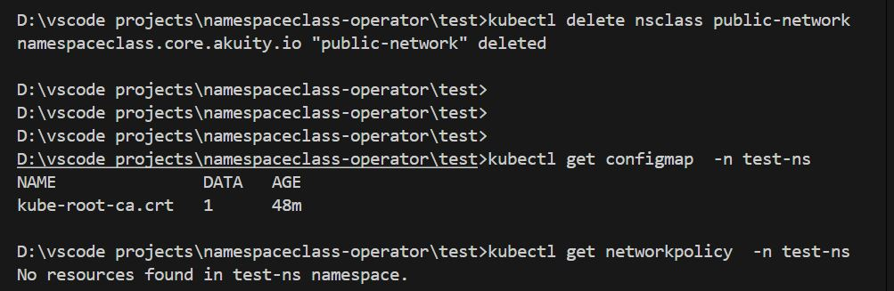

# NamespaceClass Operator

A small operator that injects resource templates into namespaces that opt-in by setting the label `namespaceclass.akuity.io/name=<class>`.

## Quick start

1. Build and run locally:
   - go build ./...
   - go run ./main.go
2. Install the CRD and examples:
   - kubectl apply -f config/crd/bases/core.akuity.io_namespaceclasses.yaml
   - kubectl apply -f test/
3. Create a namespace that opts into a class:
   - kubectl create ns demo --dry-run=client -o yaml | kubectl label -f - namespaceclass.akuity.io/name=public-network -o yaml | kubectl apply -f -

## Behavior summary
- Templates under a `NamespaceClass` are rendered into any namespace labeled with that class.
- Inventory of created resources is stored on the Namespace using the annotation `namespaceclass.akuity.io/inventory` to support pruning and cleanup.
- DeletionPolicy on the class controls clean-up behavior:
  - Cascade: operator removes resources created by the class from referencing namespaces before class deletion completes.
  - Orphan: resources remain after the class is deleted.

## Examples (visual)

- Bind — label a namespace to attach a class

*Labeling the namespace triggers the operator to create class resources (NetworkPolicy, ConfigMap, ServiceAccount, etc.).*

- Unbind — remove the class label to detach

*Removing the class label triggers cleanup of resources created by that class in the namespace.*

- Switch Class — change the namespace label to another class

*Changing the class label causes the operator to apply the new class and prune resources not present in the new class.*

- NamespaceClass update — edit/re-apply a class

*Updating a class will propagate changes to all attached namespaces when re-applied.*

- Deletion (Cascade) — class deleted with Cascade policy

*With `deletionPolicy: Cascade` the operator removes resources it created in referencing namespaces before the class deletion completes.*

- Deletion (Orphan) — class deleted with Orphan policy

*With `deletionPolicy: Orphan` resources created by the class remain in namespaces after the class is deleted.*

> Screenshots are included in `test/results/`

## Observability
- Metrics (exposed via the manager metrics endpoint):
  - `namespaceclass_applied_resources_total` (labels: namespace, class, kind)
  - `namespaceclass_pruned_resources_total` (labels: namespace, class, kind)
  - `namespaceclass_reconcile_duration_seconds`
  - `namespaceclass_reconcile_errors_total`